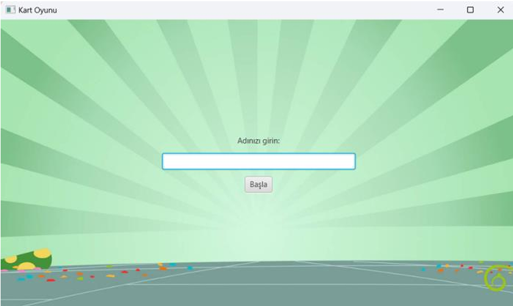
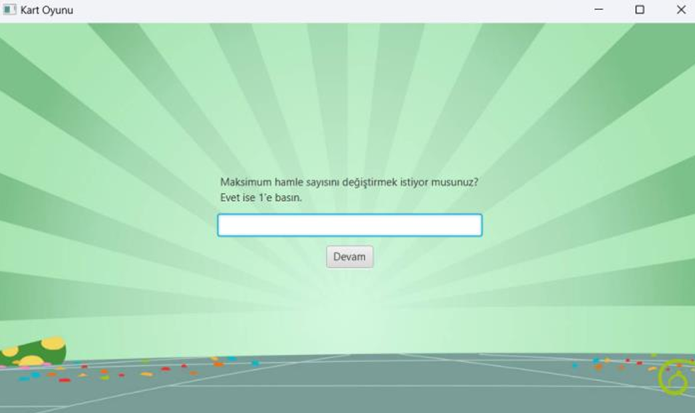
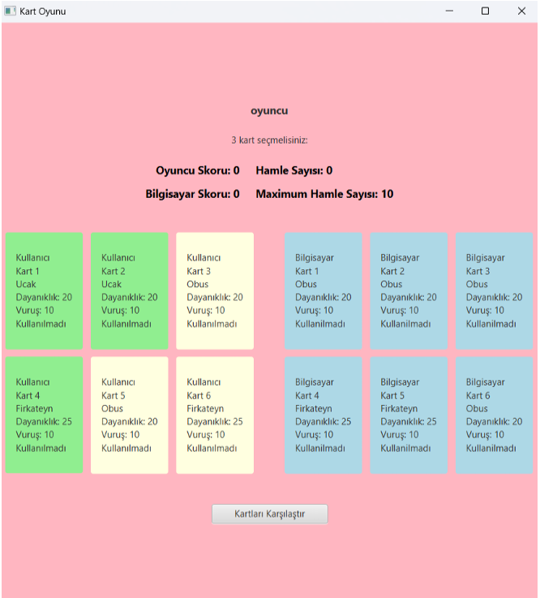
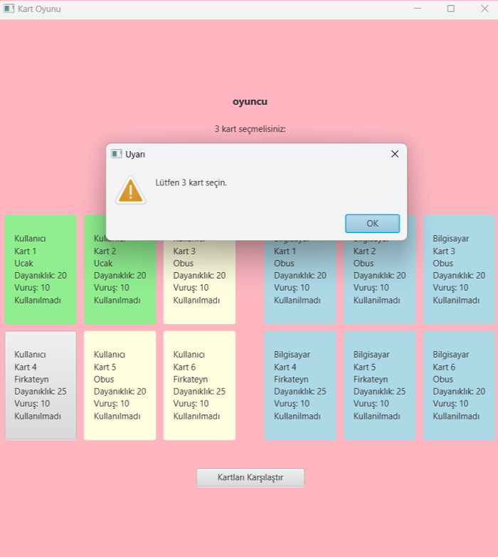
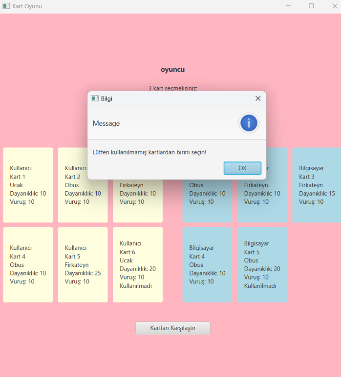
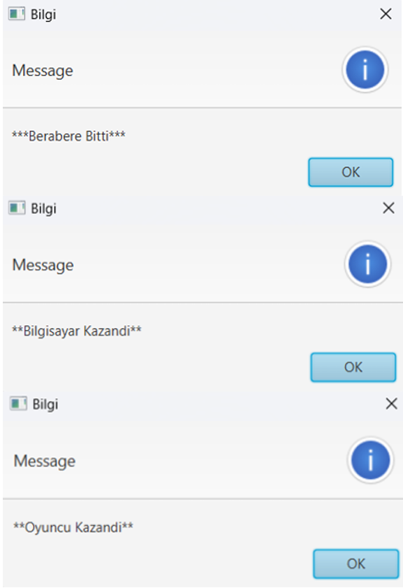

# Savaş Araçları Kart Oyunu 🃏✈️🚜🚢

Bu proje, **Kocaeli Üniversitesi Bilgisayar Mühendisliği** Bölümü Programlama Laboratuvarı-I dersi kapsamında geliştirilmiş; Nesneye Yönelik Programlama (OOP) prensiplerini temel alarak bir oyuncunun bilgisayara karşı rekabet edebileceği, stratejik hamleler ve kart dayanıklılık hesaplamaları üzerine kurulu Java tabanlı bir masaüstü kart oyunudur.

## 🚀 Projenin Amacı
Geliştirilen sistemde; soyutlama (abstraction), kalıtım (inheritance) ve çok biçimlilik (polymorphism) gibi ileri düzey OOP mimarilerini kullanarak askeri savaş araçlarını sınıflar halinde modellemek, oyuncunun manuel seçimleri ile bilgisayarın rastgele (random) hamlelerini karşılaştırarak turlar halinde bir kart savaş mekanizması simüle etmek ve sonuçları dinamik olarak raporlamaktır.

## 🛠️ Mimari ve Nesneye Yönelik Programlama Tasarımı
Projedeki tüm askeri araçlar, hiyerarşik bir sınıf (class) yapısı ve kapsülleme (encapsulation) kurallarına uygun olarak tasarlanmıştır:
* **Ana Soyut Sınıf (Abstract Class):** `Savaş Araçları` (Kartların temel vuruş, seviye puanı ve dayanıklılık değerlerini tutar).
* **Alt Sınıflar (Inheritance & Abstraction):**
  * **Hava Sınıfı:** `Uçak` ve `Siha` sınıflarına modüler temel oluşturur.
  * **Kara Sınıfı:** `Obüs` ve `KFS` (Kara Füze Sistemi) sınıflarına modüler temel oluşturur.
  * **Deniz Sınıfı:** `Fırkateyn` ve `Sida` (Silahlı İnsansız Deniz Aracı) sınıflarına modüler temel oluşturur.

## 🕹️ Oyun Kuralları ve Çekirdek Fonksiyonlar
1. **Kart Seçimi ve Dağıtım Mantığı:** Oyunda toplam 6 farklı kart türü bulunur. Başlangıçta kullanıcı, seviye puanı kriterlerine göre ekran üzerinden manuel olarak 3 adet kart seçer; bilgisayarın 3 adet kartı ise sistem tarafından tamamen rastgele (random) olarak atanır.
2. **Tur ve Savaş Mekanizması:** Her turda taraflar seçim kurallarına uygun olarak birer kart öne sürer. Kartların birbirine karşı vuruş güçleri ve dayanıklılık değerleri anlık olarak hesaplanır.
3. **Dayanıklılık ve Elenme Kritere:** Çatışma sonucunda dayanıklılık değeri sıfır veya altına düşen kartlar elenerek oyuncuların aktif listelerinden çıkarılır.
4. **Skor ve Kazanma Durumu:** Her turda üstünlük sağlayan tarafa skor puanı eklenir. Belirlenen turlar sonunda en yüksek skor puanına ulaşan veya rakibinin tüm kartlarını eleyen taraf oyunu kazanır. Tüm tur bilgileri ve hesaplama adımları eş zamanlı olarak bir dosyaya yazdırılarak kalıcı hale getirilir.

## 📊 Sınıf Hiyerarşisi (UML Tasarımı)
```text
               [Savaş Araçları (Abstract)]
                           │
         ┌─────────────────┼─────────────────┐
         ▼                 ▼                 ▼
    [Hava Sınıfı]     [Kara Sınıfı]     [Deniz Sınıfı]
         │                 │                 │
     ┌───┴───┐         ┌───┴───┐         ┌───┴───┐
     ▼       ▼         ▼       ▼         ▼       ▼
  (Uçak)  (Siha)    (Obüs)   (KFS)  (Fırkateyn) (Sida)
```
## 📸 Ekran Görüntüleri

| 1. Giriş Ekranı | Seviye Puanı | Maksimum Hamle Sayısı |
| :---: | :---: | :---: |
|  | |  |

| 2. Kart Seçim Arayüzü | Doğru Sayıda Kart Seçimi  | Kullanılmamış Kart Seçimi |
| :---: | :---: | :---: |
|   |  |  |

| 3. Skor ve Sonuç Ekranı |
| :---: |
|  |

## 👥 Geliştiriciler
* **Merve Kübra ÖZTÜRK**
* **İclal ÜSTÜN**
